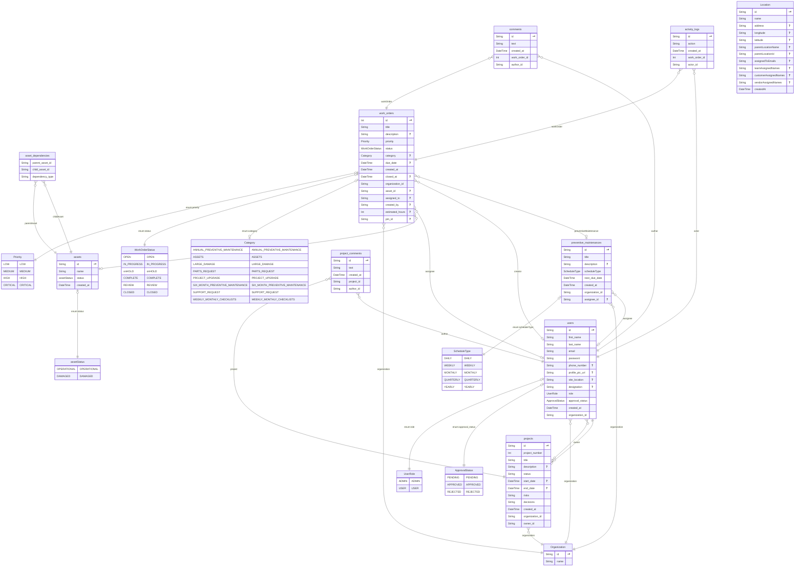

```mermaid
erDiagram

        UserRole {
            ADMIN ADMIN
USER USER
        }
    


        ApprovalStatus {
            PENDING PENDING
APPROVED APPROVED
REJECTED REJECTED
        }
    


        Priority {
            LOW LOW
MEDIUM MEDIUM
HIGH HIGH
CRITICAL CRITICAL
        }
    


        assetStatus {
            OPERATIONAL OPERATIONAL
DAMAGED DAMAGED
        }
    


        WorkOrderStatus {
            OPEN OPEN
IN_PROGRESS IN_PROGRESS
onHOLD onHOLD
COMPLETE COMPLETE
REVIEW REVIEW
CLOSED CLOSED
        }
    


        ScheduleType {
            DAILY DAILY
WEEKLY WEEKLY
MONTHLY MONTHLY
QUARTERLY QUARTERLY
YEARLY YEARLY
        }
    


        Category {
            ANNUAL_PREVENTIVE_MAINTENANCE ANNUAL_PREVENTIVE_MAINTENANCE
ASSETS ASSETS
LARGE_DAMAGE LARGE_DAMAGE
PARTS_REQUEST PARTS_REQUEST
PROJECT_UPGRADE PROJECT_UPGRADE
SIX_MONTH_PREVENTIVE_MAINTENANCE SIX_MONTH_PREVENTIVE_MAINTENANCE
SUPPORT_REQUEST SUPPORT_REQUEST
WEEKLY_MONTHLY_CHECKLISTS WEEKLY_MONTHLY_CHECKLISTS
        }
    
  "users" {
    String id "🗝️"
    String first_name 
    String last_name 
    String email 
    String password 
    String phone_number "❓"
    String profile_pic_url "❓"
    String site_location "❓"
    String designation "❓"
    UserRole role 
    ApprovalStatus approval_status 
    DateTime created_at 
    String organization_id 
    }
  

  "Organization" {
    String id "🗝️"
    String name 
    }
  

  "comments" {
    String id "🗝️"
    String text 
    DateTime created_at 
    Int work_order_id 
    String author_id 
    }
  

  "activity_logs" {
    String id "🗝️"
    String action 
    DateTime created_at 
    Int work_order_id 
    String actor_id 
    }
  

  "assets" {
    String id "🗝️"
    String name 
    assetStatus status 
    DateTime created_at 
    }
  

  "asset_dependencies" {
    String parent_asset_id 
    String child_asset_id 
    String dependency_type 
    }
  

  "work_orders" {
    Int id "🗝️"
    String title 
    String description "❓"
    Priority priority 
    WorkOrderStatus status 
    Category category "❓"
    DateTime due_date "❓"
    DateTime created_at 
    DateTime closed_at "❓"
    String organization_id 
    String asset_id "❓"
    String assigned_to "❓"
    String created_by "❓"
    Int estimated_hours "❓"
    String pm_id "❓"
    }
  

  "projects" {
    String id "🗝️"
    Int project_number 
    String title 
    String description "❓"
    String status 
    DateTime start_date "❓"
    DateTime end_date "❓"
    String risks 
    String decisions 
    DateTime created_at 
    String organization_id 
    String owner_id 
    }
  

  "project_comments" {
    String id "🗝️"
    String text 
    DateTime created_at 
    String project_id 
    String author_id 
    }
  

  "preventive_maintenances" {
    String id "🗝️"
    String title 
    String description "❓"
    ScheduleType scheduleType 
    DateTime next_due_date 
    DateTime created_at 
    String organization_id 
    String assignee_id "❓"
    }
  

  "Location" {
    String id "🗝️"
    String name 
    String address "❓"
    String longitude "❓"
    String latitude "❓"
    String parentLocationName "❓"
    String parentLocationId "❓"
    String assignedToEmails "❓"
    String teamAssignedNames "❓"
    String customerAssignedNames "❓"
    String vendorAssignedNames "❓"
    DateTime createdAt 
    }
  
    "users" |o--|| "UserRole" : "enum:role"
    "users" |o--|| "ApprovalStatus" : "enum:approval_status"
    "users" }o--|| "Organization" : "organization"
    "users" o{--}o "projects" : ""
    "comments" }o--|| work_orders : "workOrder"
    "comments" }o--|| users : "author"
    "activity_logs" }o--|| work_orders : "workOrder"
    "activity_logs" }o--|| users : "actor"
    "assets" |o--|| "assetStatus" : "enum:status"
    "asset_dependencies" }o--|| assets : "parentAsset"
    "asset_dependencies" }o--|| assets : "childAsset"
    "work_orders" |o--|| "Priority" : "enum:priority"
    "work_orders" |o--|| "WorkOrderStatus" : "enum:status"
    "work_orders" |o--|o "Category" : "enum:category"
    "work_orders" }o--|| "Organization" : "organization"
    "work_orders" }o--|o assets : "asset"
    "work_orders" }o--|o users : "assignee"
    "work_orders" }o--|o users : "creator"
    "work_orders" }o--|o preventive_maintenances : "preventiveMaintenance"
    "projects" }o--|| "Organization" : "organization"
    "projects" }o--|| users : "owner"
    "project_comments" }o--|| projects : "project"
    "project_comments" }o--|| users : "author"
    "preventive_maintenances" |o--|| "ScheduleType" : "enum:scheduleType"
    "preventive_maintenances" }o--|| "Organization" : "organization"
    "preventive_maintenances" }o--|o users : "assignee"
```
