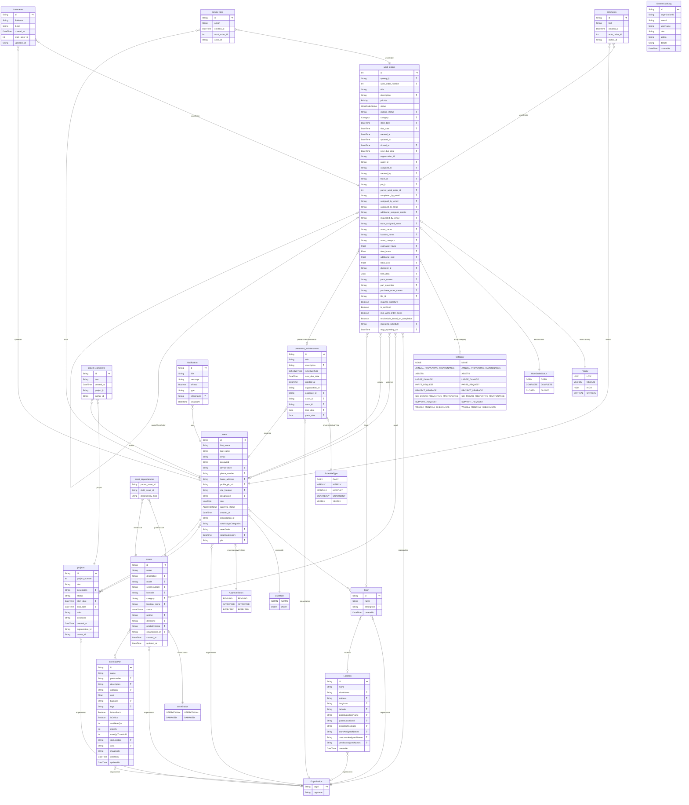

```mermaid
erDiagram

        UserRole {
            ADMIN ADMIN
USER USER
        }
    


        ApprovalStatus {
            PENDING PENDING
APPROVED APPROVED
REJECTED REJECTED
        }
    


        Priority {
            LOW LOW
MEDIUM MEDIUM
HIGH HIGH
CRITICAL CRITICAL
        }
    


        assetStatus {
            OPERATIONAL OPERATIONAL
DAMAGED DAMAGED
        }
    


        WorkOrderStatus {
            OPEN OPEN
COMPLETE COMPLETE
CLOSED CLOSED
        }
    


        ScheduleType {
            DAILY DAILY
WEEKLY WEEKLY
MONTHLY MONTHLY
QUARTERLY QUARTERLY
YEARLY YEARLY
        }
    


        Category {
            NONE NONE
ANNUAL_PREVENTIVE_MAINTENANCE ANNUAL_PREVENTIVE_MAINTENANCE
ASSETS ASSETS
LARGE_DAMAGE LARGE_DAMAGE
PARTS_REQUEST PARTS_REQUEST
PROJECT_UPGRADE PROJECT_UPGRADE
SIX_MONTH_PREVENTIVE_MAINTENANCE SIX_MONTH_PREVENTIVE_MAINTENANCE
SUPPORT_REQUEST SUPPORT_REQUEST
WEEKLY_MONTHLY_CHECKLISTS WEEKLY_MONTHLY_CHECKLISTS
        }
    
  "users" {
    String id "🗝️"
    String first_name 
    String last_name 
    String email 
    String password 
    String deviceToken "❓"
    String phone_number "❓"
    String home_address "❓"
    String profile_pic_url "❓"
    String site_location "❓"
    String designation "❓"
    UserRole role 
    ApprovalStatus approval_status 
    DateTime created_at 
    String organization_id 
    String autoAssignCategories 
    String resetCode "❓"
    DateTime resetCodeExpiry "❓"
    String pin "❓"
    }
  

  "Organization" {
    String orgId "🗝️"
    String orgName 
    }
  

  "comments" {
    String id "🗝️"
    String text 
    DateTime created_at 
    Int work_order_id 
    String author_id 
    }
  

  "activity_logs" {
    String id "🗝️"
    String action 
    DateTime created_at 
    Int work_order_id 
    String actor_id 
    }
  

  "assets" {
    String id "🗝️"
    String name 
    String description "❓"
    String model "❓"
    String serial_number "❓"
    String barcode "❓"
    String category "❓"
    String location_name "❓"
    assetStatus status 
    String uptime "❓"
    String downtime "❓"
    String reliabilityScore "❓"
    String organization_id "❓"
    DateTime created_at 
    DateTime updated_at 
    }
  

  "asset_dependencies" {
    String parent_asset_id 
    String child_asset_id 
    String dependency_type 
    }
  

  "work_orders" {
    Int id "🗝️"
    String upkeep_id "❓"
    Int work_order_number "❓"
    String title 
    String description "❓"
    Priority priority 
    WorkOrderStatus status 
    String custom_status "❓"
    Category category "❓"
    DateTime start_date "❓"
    DateTime due_date "❓"
    DateTime created_at 
    DateTime updated_at 
    DateTime closed_at "❓"
    DateTime next_due_date "❓"
    String organization_id 
    String asset_id "❓"
    String assigned_to "❓"
    String created_by "❓"
    String team_id "❓"
    String pm_id "❓"
    Int parent_work_order_id "❓"
    String completed_by_email "❓"
    String assigned_by_email "❓"
    String assigned_to_email "❓"
    String additional_assignee_emails "❓"
    String requested_by_email "❓"
    String team_assigned_name "❓"
    String asset_name "❓"
    String location_name "❓"
    String asset_category "❓"
    Float estimated_hours "❓"
    Float time_hours "❓"
    Float additional_cost "❓"
    Float labor_cost "❓"
    String checklist_id "❓"
    Json task_data "❓"
    String parts_names "❓"
    String part_quantities "❓"
    String purchase_order_names "❓"
    String file_id "❓"
    Boolean requires_signature 
    Boolean is_archived 
    Boolean root_work_order_exists 
    Boolean reschedule_based_on_completion 
    String repeating_schedule "❓"
    DateTime stop_repeating_on "❓"
    }
  

  "projects" {
    String id "🗝️"
    Int project_number 
    String title 
    String description "❓"
    String status 
    DateTime start_date "❓"
    DateTime end_date "❓"
    String risks 
    String decisions 
    DateTime created_at 
    String organization_id 
    String owner_id 
    }
  

  "project_comments" {
    String id "🗝️"
    String text 
    DateTime created_at 
    String project_id 
    String author_id 
    }
  

  "preventive_maintenances" {
    String id "🗝️"
    String title 
    String description "❓"
    ScheduleType scheduleType 
    DateTime next_due_date 
    DateTime created_at 
    String organization_id 
    String assignee_id "❓"
    String asset_id "❓"
    String team_id "❓"
    Json task_data "❓"
    Json parts_data "❓"
    }
  

  "Location" {
    String id "🗝️"
    String name 
    String shortName "❓"
    String address "❓"
    String longitude "❓"
    String latitude "❓"
    String parentLocationName "❓"
    String parentLocationId "❓"
    String assignedToEmails "❓"
    String teamAssignedNames "❓"
    String customerAssignedNames "❓"
    String vendorAssignedNames "❓"
    DateTime createdAt 
    }
  

  "Team" {
    String id "🗝️"
    String name 
    String description "❓"
    DateTime createdAt 
    }
  

  "documents" {
    String id "🗝️"
    String fileName 
    String fileUrl 
    DateTime created_at 
    Int work_order_id 
    String uploader_id 
    }
  

  "InventoryPart" {
    String id "🗝️"
    String name 
    String partNumber "❓"
    String description "❓"
    String category "❓"
    Float cost 
    String barcode "❓"
    String tags "❓"
    Boolean isNonStock 
    Boolean isCritical 
    Int availableQty 
    Int minQty 
    Int maxQtyThreshold 
    String siteLocation "❓"
    String area "❓"
    String imageUrls 
    DateTime createdAt 
    DateTime updatedAt 
    }
  

  "SystemAuditLog" {
    String id "🗝️"
    String organizationId 
    String userId 
    String userName 
    String role 
    String action 
    String details 
    DateTime createdAt 
    }
  

  "Notification" {
    String id "🗝️"
    String title 
    String message 
    Boolean isRead 
    String type 
    String referenceId "❓"
    DateTime createdAt 
    }
  
    "users" o{--}o "Team" : ""
    "users" |o--|| "UserRole" : "enum:role"
    "users" |o--|| "ApprovalStatus" : "enum:approval_status"
    "users" }o--|| "Organization" : "organization"
    "users" o{--}o "projects" : ""
    "comments" }o--|| "work_orders" : "workOrder"
    "comments" }o--|| "users" : "author"
    "activity_logs" }o--|| "work_orders" : "workOrder"
    "activity_logs" }o--|| "users" : "actor"
    "assets" |o--|| "assetStatus" : "enum:status"
    "assets" }o--|o "Organization" : "organization"
    "assets" o{--}o "InventoryPart" : ""
    "asset_dependencies" }o--|| "assets" : "parentAsset"
    "asset_dependencies" }o--|| "assets" : "childAsset"
    "work_orders" |o--|| "Priority" : "enum:priority"
    "work_orders" |o--|| "WorkOrderStatus" : "enum:status"
    "work_orders" |o--|o "Category" : "enum:category"
    "work_orders" }o--|| "Organization" : "organization"
    "work_orders" }o--|o "assets" : "asset"
    "work_orders" }o--|o "users" : "assignee"
    "work_orders" }o--|o "users" : "creator"
    "work_orders" }o--|o "Team" : "team"
    "work_orders" }o--|o "preventive_maintenances" : "preventiveMaintenance"
    "work_orders" |o--|o "work_orders" : "parentWorkOrder"
    "projects" }o--|| "Organization" : "organization"
    "projects" }o--|| "users" : "owner"
    "project_comments" }o--|| "projects" : "project"
    "project_comments" }o--|| "users" : "author"
    "preventive_maintenances" |o--|| "ScheduleType" : "enum:scheduleType"
    "preventive_maintenances" }o--|| "Organization" : "organization"
    "preventive_maintenances" }o--|o "users" : "assignee"
    "Location" }o--|o "Organization" : "organization"
    "Team" }o--|| "Organization" : "organization"
    "Team" }o--|o "Location" : "location"
    "documents" }o--|| "work_orders" : "workOrder"
    "documents" }o--|| "users" : "uploader"
    "InventoryPart" }o--|| "Organization" : "organization"
    "Notification" }o--|| "users" : "user"
```
